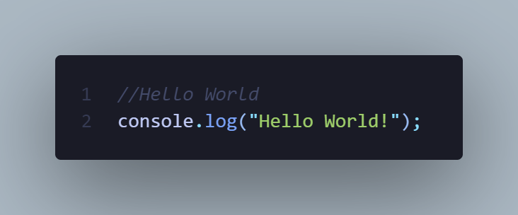

# **My Javascript journey**

   
    
   <strong>Status: Maintained</strong>
    
   <strong>Day: </strong>one
    
   <a href="https://github.com/ssimondev/javascript-journey/archive/refs/heads/main.zip"><strong>Download this repo »</strong></a>
    
   <a href="https://www.javascript.com/">Javascript</a>
   ·
   <a href="https://www.knihydobrovsky.cz/kniha/javascript-okamzite-ovladnete-javascript-za-vikend-333420605">Book</a>
  

 

> This is my javascript journey. I learned most of things from the book but I also used other sources. 
